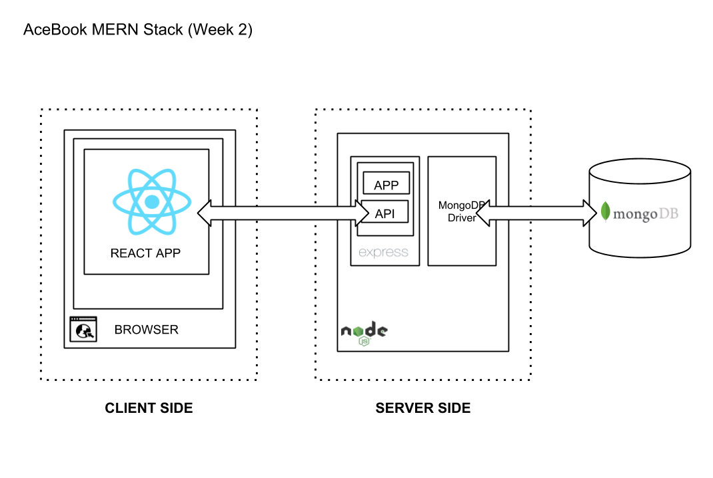

## APP STRUCTURE

[Link to edit](https://docs.google.com/drawings/d/12MViyIlRmtywxoSqjt34os9ufxodbGYmP4twm8pGJaI/edit?usp=sharing)

## INSTRUCTIONS - BACKEND APP

to be added

## DEVELOPMENT ENVIRONMENT

### `yarn start`

Runs the app in the development mode. 
Open [http://localhost:3000](http://localhost:3000) to view it in the browser.

## TESTING

### `yarn test`

Launches the Cypress test runner. 

## DEPLOYMENT

### `npm run build`

Builds the app for production to the `build` folder. 
It correctly bundles React in production mode and optimizes the build for the best performance.

The build is minified and the filenames include the hashes. 
Your app is ready to be deployed!

See the section about [deployment](https://facebook.github.io/create-react-app/docs/deployment) for more information.

## LEARNING DIARY

[Link to diary](/)
